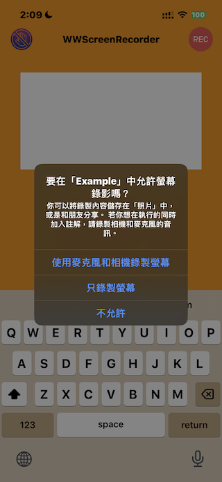

# WWScreenRecorder
[](https://developer.apple.com/swift/) [](https://developer.apple.com/swift/)  [](https://developer.apple.com/swift/) [](https://developer.apple.com/swift/)

### [Introduction - 簡介](https://swiftpackageindex.com/William-Weng)
- Simple mobile screen recording function.
- 簡易的手機畫面錄製功能。



### [Installation with Swift Package Manager](https://medium.com/彼得潘的-swift-ios-app-開發問題解答集/使用-spm-安裝第三方套件-xcode-11-新功能-2c4ffcf85b4b)

```bash
dependencies: [
    .package(url: "https://github.com/William-Weng/WWScreenRecorder.git", .upToNextMajor(from: "1.0.0"))
]
```

### Function - 可用函式
|函式|功能|
|-|-|
|startRecording(isCameraEnabled:isMicrophoneEnabled:result:)|開始錄製螢幕畫面|
|stopRecording(result:)|停止錄製螢幕畫面|

### Example
```swift
import UIKit
import WWPrint
import WWScreenRecorder

final class ViewController: UIViewController {

    override func viewDidLoad() {
        super.viewDidLoad()
    }
    
    @IBAction func startRecoding(_ sender: UIBarButtonItem) {
        
        WWScreenRecorder.shared.startRecording { result in
            switch result {
            case .failure(let error): wwPrint("startRecording => \(error)")
            case .success(let isSuccess): wwPrint("startRecording => \(isSuccess)")
            }
        }
    }
    
    @IBAction func stopRecoding(_ sender: UIBarButtonItem) {
        
        WWScreenRecorder.shared.stopRecording { result in
            switch result {
            case .failure(let error): wwPrint("startRecording => \(error)")
            case .success(let previewViewController): self.present(previewViewController, animated: true)
            }
        }
    }
}
```
